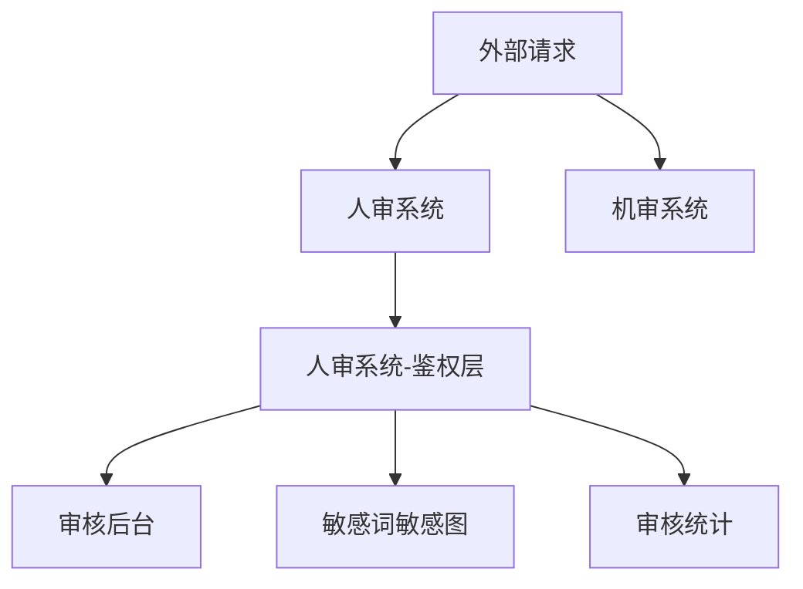
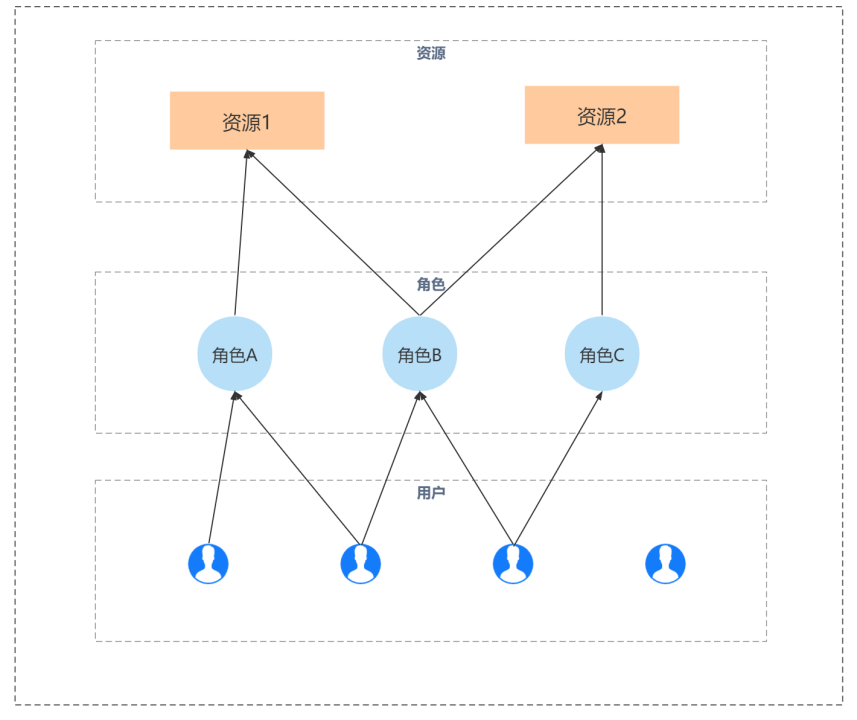
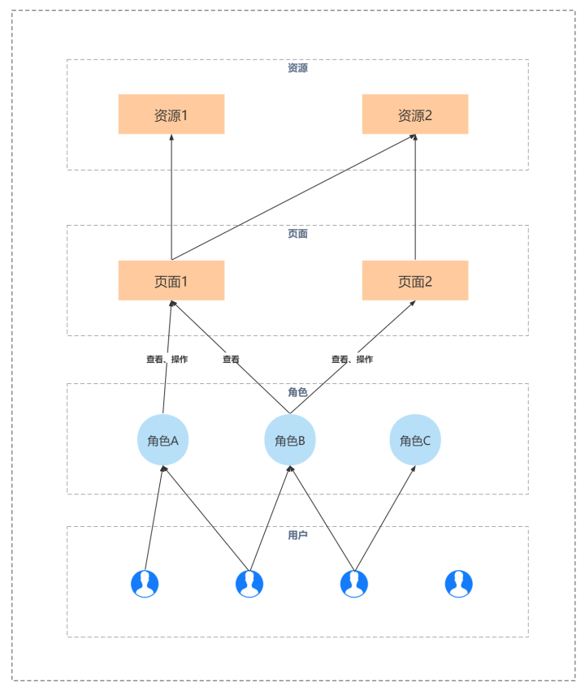

# moon-oort 鉴权系统设计

## 项目背景

在我接手时，总体业务由两个大项目组成

人审系统因为集成了用户管理功能，同时也承担了接口和页面的鉴权功能

为了快速开发，后续子服务如果要接入审核，需要先在人审平台做一次转发，通过鉴权后，请求才打到子服务上，因此也承担了部分网关工作

这个设计是不合理的

1. 接入复杂，后续新加服务均需要更新人审系统代码，添加麻烦，也会频繁发版
2. 项目性能达到瓶颈，人审系统是使用 Python3.7 编写，使用 Tornado 框架开发，后端采用了 MongoDB，框架本身性能并不出众，因为异步框架，如果代码内有阻塞会对全局造成阻塞，也会影响到子服务的使用
3. 项目过于复杂，不方便维护，因为开发时过于追赶进度，代码质量整体不高（单文件上千行），数据库字段设计也不合理（大部分业务逻辑都集中到了一个表上，字段多，查询复杂，索引复杂），
   随着审核业务接入和积累，数据量，已经出现了几次性能事故（1. 一次入审较多，积压待审量超过 5w+，审核员拉取时查询过程较为耗时，导致整个系统很慢， 2. 加索引，同步索引导致同库不可用，服务异常半小时（一小时？））

因为一些业务调整，有了时间来重构这个系统
于是重新设计了用户系统、鉴权系统和人审后台

## 新架构

设计思路：

1. 鉴权系统和业务分离
2. 把巨石架构拆分为多个子服务，如人审审核服务、统计服务、敏感词服务等
3. 所有服务纳入统一的网关，在网关层完成登录校验和接口鉴权，通过再转到对应的子服务

## 鉴权服务设计

在 RBAC 权限校验的基础上，增加了页面权限的概念

RBAC 可以理解为基于角色的权限分配，将资源分配到角色上，用户可以从属于不同的角色，从而有了不同的资源读写权限
如下图所示，角色 A 只拥有资源 1 的权限，那么对于最左侧用户，他只从属于「角色 A」，估在本系统中，他有资源 1 的权限。
同理从左数第二个用户，他有两个角色「角色 A」「角色 B」，而角色 B 可访问「资源 1」和「资源 2」那么，它就有了这两个资源的权限

Moon 在此基础上，加入了更细粒度的权限控制，对于同样的资源，在不同页面也可分配不同的权限，同时也将权限拆分为了“查看”和“操作”两种

### 网关服务设计

## 细节挖掘

### Moon 实现细节

### Apisix 插件机制
