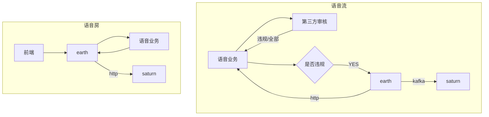
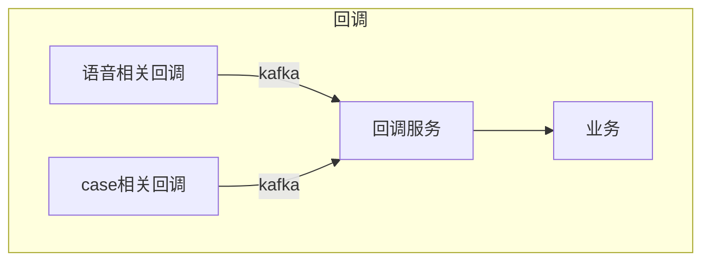
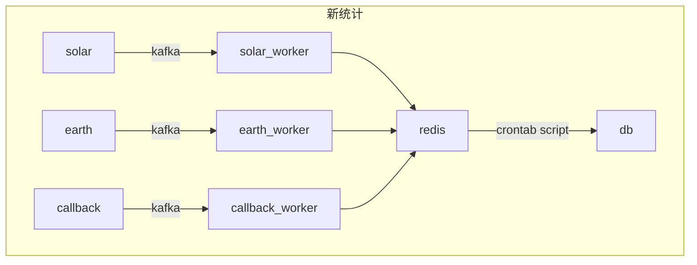

# 人审总结
在目前项目中，主体要划分的话一共可以划分出两大块: 一是机审，二是人审。
人审负责兜底以及对机审进行查漏补缺。机审通过各种模型去对文本/图片进行识别。

对于大部分的业务来说，需要审核的类型一共就以下几种：文本/图片/视频/语音
### 文本
对于文本来说，我们现存: 敏感词/色情模型/涉政模型（长短文本）/广告/攻击引战/暴恐 （注:涉政模型现在变成融合文本模型）
色情模型: onnxruntime / bert
涉政: tensorrt /bert
文本基本都是bert

### 图片
对于图片来说，我们现存: 敏感图/色情图片/涉政图片/暴恐/ ocr后过文本/二维码/旗帜/ 人脸

1. 色情 : "porn_cls15_1012.trt" 和 "EfficientNetB2_porn_cls15_202210121200.onnx" 分别是通过使用TensorRT和EfficientNet-B2模型进行训练并优化的涉黄图片分类模型
2. 暴恐/融合了涉政：
模型类型：EfficientNet-B2（'network_type': 'b2'）
类别数量：30（'class_num': 30）

3. 旗帜：
4. ocr: PaddleOCR
5. 二维码： opencv中的二维码
6. 人脸识别模型：Glint360K CosFace R18（'glint360k_cosface_r18_fp16'）
人脸检测模型（SCRFD）：SCRFD 2.5G BNKPS（'scrfd_2.5g_bnkps_shape640x640'）
人脸识别数据集：Glint360K（可能是用于训练ArcFace模型的数据集）

### 视频
对于视频来说：拆分成图片和语音过现有的模型即可。对于切帧，很容易想到的是定时切帧，但是对于大量视频和直播相关来说，量太大了，切很大概率内容是重复的。所以实际上使用的是关键帧提取。

### 语音
对于语音来说：需要过asr变为文本后再过语音文本。（推荐使用阿里开源的funasr）

## 人审服务现状
目前人审主要展现形式是，在机审中通过产品获取数据对每个业务通过模型召回的数据做阈值评估，后划分pass/review/reject三种。然后与业务沟通判断送哪些数据给人审：通常是review，但也有业务需要全量送。

在人审中由于我们是多业务多项目的情况，所以我们的基本粒度是对齐机审，以biztype为业务的基本粒度。

但对于不同的biztype有不同的划分，由于人力的紧张和某些业务和数据的重要性程度，我们又划分出了分区，以及分区的优先级。

同时由于前端模版和审核速度的限制，我们尽量让同一类型的数据一同审核，每个biztype下还会划分图文/图片/文本/视频等类型

总结而言就是：appId -> zone -> biztype -> dataType

此外考虑到审核效率以及人也不是100%可靠的问题，同时也出于对审核人员进行考核的顾虑，我们需要对审核数据进行复检，但不能全量进行复检（毕竟量过大），所以我们存在质检功能，以及复审功能，以及统计和绩效功能。

这都是基于审核上的业务逻辑，对于质检，我们
人审目前主要有审核/质检/统计等相关功能

同时考虑到审核效率以及人也不是100%可靠的问题，我们需要对其进行约束，所以人审业务还包含质检以及统计以及回查以及二审等相关再次确认的内容。
从质检来说，由运营配置哪些业务需要进行质检。然后使用定时任务对已审数据进行抽取。

从复审来说，对于某些重要业务怕审核出错，需要二次确认。审完后判断是否需要复审，转移到另一边即可。

从统计来说，每次进行审核都会将审核数据发到统计服务。（最开始通过http调用，后续改成kafka），拿到数据后会进行审核的操作历史记录和数据统计。

从绩效来说，基于上述数据可以对每个审核员审了哪些业务和类型，以及审核准确率进行判断。
但目前的绩效实现还是基于脚本配置，实际基于统计服务的数据进行实现更合理且不会扫描人审的db，对人审造成负担。

## 语音审核相关
对于直播（语音/视频）相关的业务，不同于传统场景对静态数据进行处理，直播是以流形式进行传输和处理的。

对于直播相关，最开始设想是完全有我们进行审核。实际也开发完成并接入了，使用xxl-job作为分布式调度平台，对每一个流进行下发任务，每10s进行一个音频/图片切帧。后续由于成本问题以及语音相关接入的是第三方，对方也提供相关审核，同时成本不高等原因，已经废弃。（代码已删除）

后续需要继续进行直播相关业务的扩展，需要考虑，对每一个直播流的切流行为，通过什么进行调度？哪一个分布式调度平台比较好？（出于对每个任务只进行调度一次的考虑）
以及图片相关的切帧行为使用关键帧替代。同时asr模型以及后续的文本模型需要保证准确率，需要调整阈值。

现状是：

人审对于语音流业务存在两种审核情况: 房间巡查以及语音片段审核。
语音片段目前已经对齐了case审核。只需要当成一种case处理就行（目前还是使用单独的表，后续重构可以考虑直接融合到现有情况中）

语音房巡查则是通过审核员加入到房间中实时听取房间语音，对房间和用户进行处理。

目前存在两大类型业务：迅雷的hiya系以及最右的派对系。

目前都是对两边提供的接口进行了兼容，实际应该我们制定接口规范，对方照着接口提供数据。

语音房巡查目前也只在派对中存在。

同时对于回调与case相关的处理又不一致，目前是通过http直接回调给业务，实际我们需要一个回调服务来确保回调成功。

### 绩效业务相关
目前的绩效业务也存在earth中，同时开发完了并没有完全用上。后续尽量解耦即可

## 人审服务相关
包含几大块服务：
1. 人审earth
2. 统计saturn api
3. 新统计epimetheus

### saturn
saturn作为老项目，承担了统计/操作记录/未审数量展示等功能，之前都通过http进行调用，后续通过kafka进行解耦。以及优化了统计时redis的key扫描问题（之前常出现keys的扫描问题）
本质是keys层级太多，以及粒度太细。

这里的数据统计区分于新统计，Saturn只对人审相关数据进行统计，包含质检复审等等。

### epimetheus
此项目通过消费solar数据以及earth数据以及回调数据进行统计。同时落库，然后grafna从数据库中读取数据进行展示。

原本是想将告警相关业务以及脚本相关业务都集成进此项目，使用go的cron框架进行调度。（todo）

## 后续优化
1. asr准确率可以使用funasr模型（天巡已在使用）
2. 语音审核的通用逻辑没开发，后续需要补充，同时对于语音业务前端没有进行界面化，以及本身并没有完全配置化。
3. 人审回调还是通过http对solar进行回调，后续可以优化
