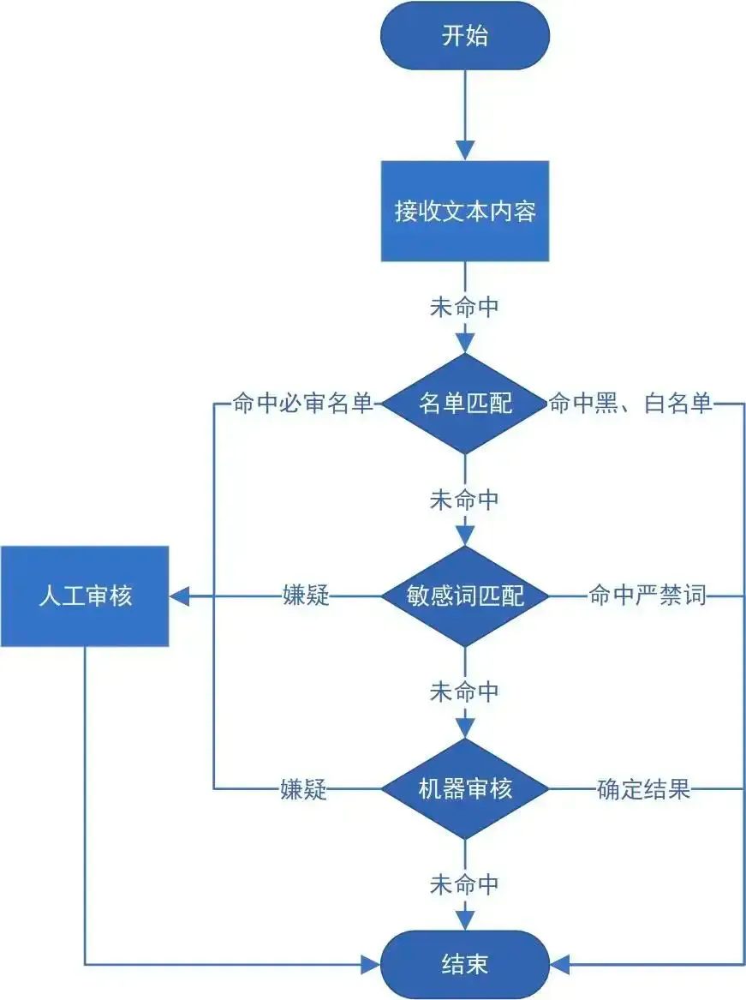

# 什么是风控

风控是指风险管理者采取各种措施和方法，消灭或减少风险事件发生的各种可能性，或者减少风险事件发生时造成的损失。风控领域的划分其实很多，其中包括：

## 网络风控

网络风控是指针对网络环境中的各种安全风险实施的控制措施。这包括网络入侵检测、防火墙设置、加密通讯、安全漏洞修补等措施，以确保网络系统的安全和稳定性。

ex. 云计算服务提供商的**数据备份与灾难恢复、防火墙、入侵检测系统**等技术

## 内容风控

内容风控通常应用于在线平台或社交媒体等环境，旨在监测和管理用户生成的内容，以防止违法、有害或不当内容的传播。这包括使用技术手段和人工审核来识别并处理问题内容。

ex. 电商平台也会采取内容风控措施来**阻止讨论销售侵权商品或违禁品**、微博采用舆情分析技术来查找管控涉政的言论。

## 数据风控

数据风控是指对数据安全、隐私和完整性进行管理和保护的过程。这包括识别潜在的数据风险、采取措施确保数据质量、保护数据安全以及合规性。

ex. 日志监控系统，通过**大量数据流量和日志分析（**检测**）**，发现潜在的网络攻击。

# 内容安全行业内通用做法

## 业内场景解决方案比较


| 做法             | 优势（对业务）                                                                                                                            | 劣势                                                                                                                                                                                                                 |
| ---------------- | ----------------------------------------------------------------------------------------------------------------------------------------- | -------------------------------------------------------------------------------------------------------------------------------------------------------------------------------------------------------------------- |
| 采购第三方服务   | 1. 降低人力成本：无需投入研发的成本、团队维护的成本；<br />2. 对接简单：直接用第三方的 SDK 即可，无需做过多研发，一般也有完整的接入文档。 | 1. 效果： 采购到的服务可能是达到预期的效果，比如需要特殊定制化某种社交场景的敏感词，通用的标准一般达不到预期，会很容易尝试误判或漏审;<br />2. 数据安全问题：国内的 SaaS 很多会数据送去训练模型，风险上需要特别处理。 |
| 自建运营团队维护 | 1. 支持定制化场景的配置；<br />2. 数据由自己的公司维护，没有泄露的风险(这里是相对的安全，非完全安全)。                                    | 需要投入团队，研发时间等，同时需要定期评估效果等。                                                                                                                                                                   |

核心关注以下两个指标：

- 风控拦截有效性, 一般而言有: 匹配的实效性是否有保证、匹配的准确度是不是达到预期的效果
- 成本, 包含: 研发成本、机器成本、人员投入成本等

## 自建方案路线的解决方案

在内容安全领域，会划分机审和人审两个模块，各自有其技术解决方案。

### 机审

**定义**

机审是指利用计算机程序和算法自动进行内容审核的方法。

**技术方案**

1. **关键词、敏感图匹配**

系统会预先设定一些关键词或规则，当内容中出现这些关键词时，系统会自动标记并进行审核处理。

如：全文本比对、哈希比对、向量相似检测（**欧式距离、汉明距离、余弦距离**相似度检测）、算法结合的告诉匹配（KMP 算法）

1. **AI识别**

基于人工智能技术，机器学习等方法训练模型来识别不良、危险或违规内容，从而实现自动审核和过滤。

如：[Google](https://zh.wikipedia.org/wiki/Google)提出的 Bert 模型（一个优秀的自然语言处理模型）

**机审的优势和劣势**

机审优势：机审可以快速大量处理数据，减轻人工审核负担，提高工作效率，并且在一些简单、明确的情况下具有一定可靠性。

机审劣势：在处理复杂、多义性或变异性较大的内容时，机审的准确性较差，容易出现漏审或误审的情况。即使是使用 AI 识别，也需要“长期团队维护” 以及 “大量的模型数据”支持才能达到预期效果。

### 人审

**定义**

人审是指由审核员进行内容审核的方式。

**人审的优势和劣势**

人审优势

- 人审能够更好地处理复杂情况，具有更强的主观判断和灵活性，在处理某些复杂、模糊或难以处理的情况时更为有效。对于一些需要深度理解和判断的内容（需要理解特定语境，如涉及文化、历史和社会背景场景下）具有独特优势。

人审劣势

- 成本较高：在大规模内容审核时存在人力资源限制。
- 效率较低：人审的实时性相对机审核较差。

### 总结

因此，通常在内容安全业务中，会综合使用机审和人审相结合的方式，充分发挥二者的优势，达到更全面、高效的内容审核结果。

# 自建风控审核中台的整体流程

## 方案背景

1. 产品类型多、场景多

   比如语音产品、社交聊天产品、云盘产品等，聊天产品还会划分很多场景，包括 IM 群聊、私信、朋友圈等，每个产品\场景的管控粒度也不一样。
2. 审核数据量大

   一天有几百万的数据需要过审。
3. 人工审核团队的人员成本高

## 审核中台

基于上述背景，审核团队围绕机器审核、人工审核两大模块，构建审核中台，串联算法团队、人审团队，构建内容审核的整个生命周期。


| 关键环节 | 功能、目的                                       | 处理方式                                                                                         | 优点                                                              | 存在问题                                             |
| -------- | ------------------------------------------------ | ------------------------------------------------------------------------------------------------ | ----------------------------------------------------------------- | ---------------------------------------------------- |
| 策略配置 | 高度自定义化，可自由配置用的                     | loading 策略在缓存和 DB，热更新策略                                                              | 减去沟通成本，由产品与业务方沟通即可完成对接全流程。              | 拓展性可能不够好，需要持续新加功能                   |
| 黑白库   | 做特化处理，降低后续流程的审核量                 | 白名单过滤，如能保证百分百安全的特殊内容直接不过审。黑名单过滤，如名字来源异地异地 IP 的特殊处理 | 提前发现风险，很明显的内容直接吹了，降低后续流程设计量            | 不能全量拦截违规内容                                 |
| 机器审核 | 人工审核的工作量，提高审核效率                   | 把模型抽象成一种能力，基于配置决定是否走这个能力                                                 | 匹配实效性和成本相对人审高                                        | 机器准确不足                                         |
| 人工审核 | 做内容审核的最后安全兜底，最终保证               | 人工打标后异步通知告诉业务方，多用于先发后审的场景                                               | 准确率高                                                          | 成本高，流程慢                                       |
| 质量检查 | 对人工的审核效果做评估                           | 定期捞部分数据送二审，评估之前人审的效果                                                         | 提高审核员质量，有跟高纬度的指标（人审错出率等）评估人员效率      | 评估指标涉及绩效，需要做到公平合理                   |
| 回查     | 对新出的敏感词，再次巡查，找出前面漏出的违规内容 | 保存业务的分享内容，巡查完成后，告知对方可能存在的违规分享内容                                   | 对审核业务场景有兜底的发现问题策略，有点像 billing 的旁路验证系统 | 全量保存数据量很大，保存成本，可能需要设计大型数仓等 |

审核中台终态：



图 1 - 内容审核中台的架构预想

# 敏感词模块

## 设计背景

- 对上下文语义不复杂的场景，希望能够迅速找出违规内容
- 算法团队每次训练模型所需的时间过长，对突发事件的更新不及时

图2 - 敏感词匹配的具体流程

## 解决方案

### 全文本匹配

- 对进来的文本，每次都做遍历。
- 将 Redis 中的敏感词库在服务启动时加载到内存中，每次从 Redis 中读取敏感词库，利用 `indexOf()` 查看输入文本是否存在敏感词。

这里举例子，体现此方案文本匹配的速度如何

```bash
=== RUN   TestMatchersV2/Simple
    matcher_text_test.go:137: times: 100235125
    --- PASS: TestMatchersV2/Simple (11.15s)
```

**结论**：鉴于数据量的庞大（词库的量大，待匹配串的长度大），所以每次从 Redis 中读取敏感词库，然后执行`indexOf()` 的做法，匹配的时间、效果效率不够高，已经不太适用该场景。

### AC 自动机

AC 自动机 + 失配指针来实现敏感词匹配

AC 自动机简单来说就是字典树匹配

https://github.com/ZebraWyf8888/audit/blob/main/敏感词总结.md

https://github.com/ZebraWyf8888/audit/blob/main/敏感词总结-V2.md

使用 AC 自动机后的匹配效率

```bash
=== RUN   TestMatchersV2/Simple
    matcher_text_test.go:137: times: 100235125
    --- PASS: TestMatchersV2/Simple (11.15s)
=== RUN   TestMatchersV2/ACAutomaton
    matcher_text_test.go:137: times: 27575
    --- PASS: TestMatchersV2/ACAutomaton (0.07s)
```

# 结合 Email / SMS 风控业务的建议 (WIP)

## Background

一款面向海外的 Email 和 SMS （帮商家和客户建立连接）产品，风控做的比较特殊，主要是防止贩毒和钓鱼邮件的，跟国内的内容安全不一样。

## Question

- **当我们对系统判定的准确率没信心的时候，通常是怎么解决的？**

  - 背景补充

    当前 Email、SMS 都是先审后发的
- **Content 需要过多 filter 的时候，单个 filter check 耗时长的问题**

  - 背景补充

    1. 创建一个内容（生成一个内容 Id，准备发送），有一个 save 的动作
    2. 圈定一大批名单（分主动圈和被动圈，主动就是自己勾选，被动就是从策略规则里面选出来）
    3. （和 2 这个过程是异步的）如果有 save 动作，就把这些内容过风控审核，这个流程巨长，就是一大堆过滤器（黑白名单，敏感词都放一起）。
    4. 如果有违规内容就发不了，没有就可以发。

    补充：

    1. 过滤器可能还会结合一些其他的内容，比如豁免政策，就是一些国家对一些词不要处理。
    2. 没有敏感词和敏感图，主要是 各种各样的filter （过渡到第一个可以优化的建议）
       

## Solution

[当我们对系统判定的准确率没信心的时候，通常是怎么解决的？]

- 云盘的处理场景

  可以在对系统判定的准确率没信心的时，区分加特定的返回值处理；并且根据“配置中心”的结果，决定是否下发人审。

  给定的 case，有三种返回结果：

  - Pass: 有信心一定不违规的内容、白名单里面的内容。
  - Reject: 命中高危词库内容，命中黑名单文本内容。
  - Review: 审核算法模型给定的分值处于违规和不违规的临界值。

  在大部分网盘中的实现，会对 Review 的内容做放出 && 异步转人审，对后续人审结果

  好处：保证 case 最终不漏判，不会影响用户体验

  坏处：可能存在延迟，漏出，如：人审时间过长，导致违规内容已经达成传播效果。

[](https://www.notion.so/1d8b59244ecc4e22b1ec345a94119417?pvs=21)

[Content 需要过多 filter 的时候，单个 filter check 耗时长的问题]

[](https://www.notion.so/d2da081b23d24c818bc85da9a3d6cc5c?pvs=21)

## Else - QA

### **Q1：在内容安全领域，针对 Email 和 SMS，技术上有什么帮助更好的提升业务？**

**目的**

- 提高审核人效
- 提高准确率

**相似图检索**

- 背景：由于市面上很多违规图其实都有很多大一部分相似，甚至一模一样。因此对于非常常见的图，可以加入相似图检索服务。
- 做法：把图片转为一个一个的向量，这个向量可以反馈出图片的特征，通过向量去做相似匹配。
- 好处：不吃 GPU、开源实现，有了这个相似图检索，可能可以降低人审的量。
- 举例：前期使用的时候，可以在  Email 和 SMS 人审核的时候给出一些特殊标识，就表明“与之前的违规图片相似” ，帮助人审核快速发现问题。
- 参考链接：

  - https://github.com/postgrespro/imgsmlr
  - https://help.aliyun.com/zh/rds/apsaradb-rds-for-postgresql/pgvector-for-high-dimensional-vector-similarity-searches
- 指标

  两个 512G 的数据盘，机器是 8 核 16G 了，20 秒内基本能完成检索。

**邮件审核模型**

- 背景：市面上也有很多审核模型，的场景也有，基本都是基于 Google-Bert 训练的 NLP 模型，在有需要的场景，我们也可以适当用起来，拿几个现成的模型试试看。
- 参考链接：
  - https://briefgpt.xyz/a/2402.13871
  - https://www.cnblogs.com/NosenLiu/p/14956415.html

### **Q2：风控的衡量指标？**

- 在内容安全领域的衡量效果指标的方法有哪些

  - **机审：**

  方法一：当时主要是通过业务的反馈，会有很多辅以观测的报表。

  ex.这个新上的产品，在涉政领域比较差，出现很多漏审，那我们就会去反过来优化我们的涉政词库和涉政文本模型。

  方法二：与第三方的服务做对比，会切部分业务的数据流量，去跟业内产品“网易易盾”、“数美”做比较。通过观察不同处理组的表现，可以更好地了解各种内容安全系统的优劣之处。

  ex.我想看看业内的其他产品效果和我们比较，广告模型上有什么缺陷，我调用了一批数据去访问他们的接口看返回，和我们的结果看返回，最终以人工审的为标准。

  - **人审：**

  质检，做抽样检测，抽取已审的数据，再去过审核，最终评估审核员的审核效果。

  邮件场景关注点可能是到达率这些，安全上不要阻塞流程的同时，可以发现问题就可以。
- 采用灰度的方式，尝试买一些我们的竞品、或者尝试部分第三方审核，看看他们的实现如何？从审核实时性和审核时间效率等方面去评估。
- 违规 case 的记录和汇总，如记录违规 case，然后分类，过一段时间总结，然后优化这些 filter
- 人审可以引入质检
