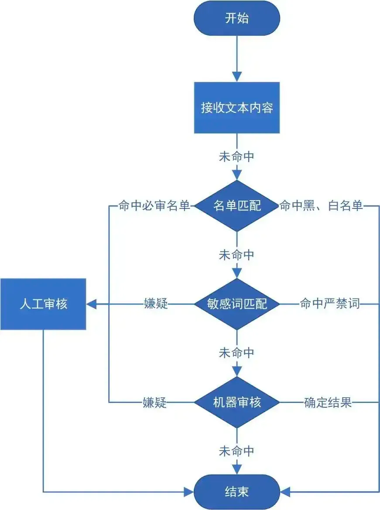
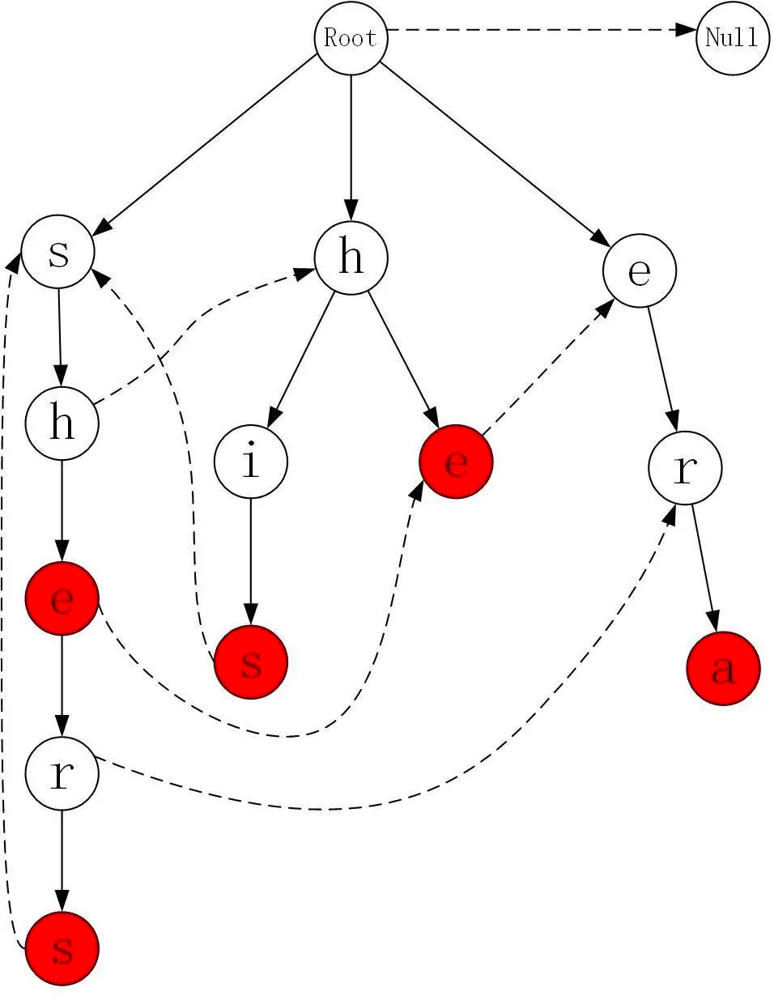

## 背景

我之前的工作内容是多媒体内容智能识别服务，支持对图片、视频、文本等对象进行多样化场景检测，有效降低内容违规风险
我们的这个内容审核平台，对接到迅雷下载、最右各种社交的聊天消息、甚至还有第三方商业客户的数据
能够帮助发现违规的内容。这里面涉及的领域很多。
因为我是技术方面的，我这里介绍着重介绍，我之前做的一个敏感词过滤服务。
这是一个很经典的需求场景，目前要对一个每天上千万消息做敏感词过滤。

## 目标

产品持续健康的发展

## 具体的流程

这个图其实挺好的，说明我们对数据处理的一个流程。
大体分两个部分，一个机器审核，一个是人工审核。
我们这里主要讲的是机器审核的部分。
机器审核存在的目的是为了降低人工审核的工作量，提高审核效率。

机器审核分三个模块：
1、黑白名单过滤（特画处理）
2、敏感词过滤
3、算法内容识别

### 存在的问题

1. 为什么要有敏感词，我们单纯依赖算法不行吗？
   - 我们的算法模型训练也需要时间，对突发事件的更新不及时
2. 匹配的效率不够：时间、效果
   - 比较容易想到的解决方案：
     - 对进来的文本先做分词，然后每次从 Redis 中取出敏感词集合，然后做遍历操作.
     - 将 Redis 中的敏感词库在服务启动时加载到内存中，每次从 Redis 中读取敏感词库，利用 `indexOf()` 查看是否存在.
     - 同样将敏感词库读到内存，使用 Bloom Filter 算法，将敏感词打散到内存位数组中，每次将消息放进去看是否匹配到.

**结论**：鉴于数据量的庞大（词库的量大，待匹配串的长度大），所以每次从 Redis 中读取敏感词库，`indexOf()` 已经不太适用该场景.

##### 

这里举例子，说明匹配的速度慢

### 更好的解决方案

**算法内容的介绍**：
敏感词匹配功能算法功能：

- 可以迅速地匹配文本中的敏感词汇，算法平均耗时为50ms
- 因其简单、快速、直接、灵活的特点，成为了审核人员对抗垃圾文本的利器。

* 词库量大，需要维护和加载百万级别的词库（模式串）；
* 敏感词与业务特性、国家政策相关性强，无法统一约定长度、前缀等特征。
* WM算法对模式串的长度和前缀存在一定的要求，可能会影响业务的使用。虽然AC自动机加载耗时长，内存占用大，但敏感词加载并不频繁，且服务器内存资源充足，所以我们最终选用AC自动机作为底层算法。

**举例**：

模式串集合{“she”, “he”, “shers”, “his”, “era”}构建的字典树

- 含义 1：每个节点代表一个字符，从根节点到某一个节点的路径，即可表示一个模式串
- 含义 2：红色节点表示一个字符串的终结。这么做的好处是： 从字典树的根节点出发，可以快速的查找到某个模式串。
  拥有相同前缀的模式串会合并到同一个子树中，节省空间
- 含义 3：Fail指针，虚线画出了部分节点的Fail指针，未画出虚线的节点，其Fail指针指向根节点。
  ——KMP 算法的理念：记忆搜索，dp 动态规划，谈心。简而言之，就是利用已有的信息减少匹配次数
  具体内容请参阅 [GitHub 链接](https://github.com/ZebraWyf8888/audit/blob/main/%E6%95%8F%E6%84%9F%E8%AF%8D%E6%80%BB%E7%BB%93.md).

[匹配过程](https://vdn6.vzuu.com/SD/887f3f24-5669-11ec-a65b-ea32bff4616b.mp4?pkey=AAWeWqTUmjat8UVKcxclT_4MrcvRm5fDKXibmnUjTJTEgHLXhLmrt2vSrz4UuFNOtK2LIAv2aHvqxQOvBCeVfgXP&c=avc.0.0&f=mp4&pu=078babd7&bu=078babd7&expiration=1719143101&v=ks6)

## 结合业务的优化

1. **词库拆分**：一颗很大的树，我们拆分成好几颗小树
2. **组合词的处理**：对匹配的结果，多做一次 map 映射，结合词组的映射关系，来判断是不是命中，属于是后置处理
3. **词汇不准确的处理**：我给词写成 色 xxxx ///情怎么办？
   - 中文分词算法，属于前置处理。
   - 字符处理截取，属于是前置处理
4. **反过滤器词**：
   - “学习近代史来公平”，“学习”做这个可以尽可能降低审核人员的工作量，这个也属于前置处理。
5. **拼音处理**
   - v1.0 采用拼音算法模型，把文本转为拼音，多音字场景不好处理
   - v2.0 采用文本和拼音各遍历一次的场景
6. **内存的处理问题**：
   参考资料：[文章关于内存的优化](https://www.cnblogs.com/vipsoft/p/17774393.html), pprof, 懒加载

## 具体指标

- 算法平均耗时为50ms
- 词库 一个词库5-6百万数据，都在内存构建AC自动机
- 一个业务有2-3个词库，一个词库有5-6万词
- QPS 5w，单机5w 3台 8核64g.
