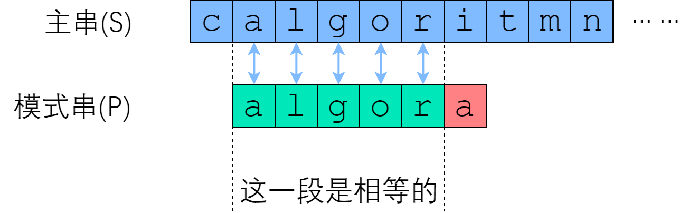

# 敏感词总结
## 现状
现有的敏感词是基于**ac自动机**编写的，并抽象出一层业务相关的逻辑。以及对字符串前置的预处理和后置的处理。

1. 对敏感词附加业务逻辑：如词库（逻辑上分库，表上新增字段），词的分类（如涉政/色情等），词的等级（禁用/敏感等），业务相关逻辑（如对每个业务进行词库的划分，只会匹配词库内的内容），**本质是做了一层隔离**
2. 基于ac自动机匹配之外额外添加匹配模式:如包含/组合/有序组合/精准匹配
   或除ac自动机外其他字符串匹配算法: 如正则
3. 前置预处理包含文件名后缀处理/英文字符/pinyin/特殊符号等处理
4. 后置处理包含反过滤词（如包含此词则不会命中）
5. 暂未但是可以增加的功能：词和词库的操作记录


## ac自动机
AC自动机是以Trie的结构为基础，结合KMP的思想建立的自动机，用于解决多模式匹配等任务。
>（注：什么叫多模式匹配呢？
>>单模式匹配是指在一个模式串和一个主串之间进行匹配（即:在一个主串中查找一个模式串。
>
>> 多模式匹配是指多个模式串和一个主串之间进行匹配。（即一个主串中查找多个模式串）

ac自动机的构造的步骤一般分为两步:
1. 基础的Trie结构:将所有的模式串构成一颗trie树
2. kmp的思想:对trie树上所有结点构造失配指针

### 1.字典树
敏感词基本以中文为主，或以拼音为主。（以拼音为主主要是在同音字场景）
我们可以使用char或string 表示当前节点。
```go
type Node struct {
	char     rune
	father   *Node
	children map[rune]*Node
	fail     *Node

	len  int
	word string
}
```
借助map提升查找效率（敏感词大部分以中文为主，长度不固定）
同时增加自己的业务字段进行处理，如长度和整个词。


### 2.kmp算法
首先了解一下ac自动机的原理，那就得先看kmp算法: kmp是字符串的单模式匹配算法。

字符串匹配问题可以描述为: 判断字符串P是否是字符串S的字串？是的话它出现S中的哪个位置中？

朴素的思想就是暴力计算，使用两个for循环去从头到尾比较，如果第二层循环不匹配则跳出，第一层循环往下位移。头节点改变，再重新匹配后面一段。

那么怎么去优化呢？
> 尽可能利用残余的信息，是KMP算法的思想所在

在暴力算法之中，如果我们在i位置开始匹配时，匹配失败了会转移到i+1位置继续进行匹配。可以注意到如果s串与p串是从位置r匹配失败的，那么s从i到r - 1的字符和p的0 - r - 1个字符是一样的。


从跳过不可能成功的尝试方面思考，kmp提出了next数组
> next[i] 表示 P[0] ~ P[i] 这一个子串，使得 前k个字符恰等于后k个字符 的最大的k. 特别地，k不能取i+1（因为这个子串一共才 i+1 个字符，自己肯定与自己相等，就没有意义了）

样例1中为[0,0,0,0,0,1]，看一个别的的样例。

在ab c ab 中，前2个字符等于后两个字符，所以数组构造如上。

这个有什么作用呢？对于一个字符串来说：我当前前缀与P[0]~P[r-1]这一段时相同的，我需要从头匹配，如果继续位移下去怎么才能得到更好的结果？

如果当前前缀的下一个字符与已匹配字符串的最长相等前缀后缀的下一个字符相同，那么我们可以直接将前缀的长度更新为最长相等前缀后缀的长度，继续匹配后续字符。这样可以避免重复匹配已经匹配过的部分，提高匹配效率

```
举例：
S: ababaabaabac
P: abaabac
next: [0,0,1,1,2,3,0]
当p匹配s时:
ababaabaabac
aba
匹配失败，拿到next[2] = 1 —->
ababaabaabac
  abaaba
匹配失败，拿到next[5] = 3 -->
ababaabaabac
     abaabac
匹配成功
```

```java
public int[] getNext(String p) {
    int[] next = new int[p.length()];
    for (int i = 0; i < p.length(); i++) {
        next[i] = getNextNum(p, i);
    }
    return next;
}

public int getNextNum(String p , int x) {
    for (int i = x; i > 0; i--) {
        if (p.substring(0, i).equals(p.substring(x - i + 1, x + 1))) {
            return i;
        }
    }
    return 0;
}

public List<Integer> search(String s, String p) {
    List<Integer> ans = new ArrayList<>();
    int[] next = getNext(p);
    int idx = 0;
    for (int i = 0; i < s.length(); i++) {
        while (idx > 0 && s.charAt(i) != p.charAt(idx)) {
            idx = next[idx - 1];
        }
        if (s.charAt(i) == p.charAt(idx)) {
            idx++;
        }
        if (idx == p.length()) {
            ans.add(i - p.length() + 1);
            idx = next[idx - 1];
        }
    }
    return ans;
}

```

#### 如何高效得到next数组（本节不重要）
> 快速构建next数组，是KMP算法的精髓所在，核心思想是“P自己与自己做匹配”。

在next数组中表示的是: 一个数量为k的前缀和一个数量为k的后缀相等
这就表示一个匹配：前缀和后缀相等。
以一个字符串为例子进行匹配:
```
P: abababzababab
前缀: a, ab, aba, abab, ababa, ababab, abababz, ...
后缀: b, ab, bab, abab, babab, ababab, zababab, ...
可知在ababab中匹配了6个，是最大的
次大的是abab4个，（次大匹配必定在最大匹配 ababab 中，所以次大匹配数就是 ababab 的最大匹配数）
——>
P: ababab
前缀: a, ab, aba, abab, ababa
后缀: b, ab, bab, abab, babab
依次类推
```

```java
public int[] getNext(String p) {
    int[] next = new int[p.length()];
    int now = 0;
    for (int i = 1; i < p.length(); i++) {
        while (now > 0 && p.charAt(i) != p.charAt(now)) {
            now = next[now - 1];
        }
        if (p.charAt(i) == p.charAt(now)) {
            now++;
        }
        next[i] = now;
    }
    return next;
}
```


### 3.ac自动机构建
回到ac自动机上，在构建的两个步骤里，我们会将若干模式串（敏感词/组合敏感词（本质是多个模式串））丢进字典树中。正常的字典树构造即可。
> 字典树中的结点表示的是某个模式串的前缀。我们在后文也将其称作状态。一个结点表示一个状态，字典树的边就是状态的转移

所以构建ac自动机分为两步：
1. 构建字典树
2. 构建失配指针

在构建字典树时，与正常字典树的构建并无太大区别。（但是对于大数据量的服务，里面存在很多可优化的点：如，子树的延迟创建优化以及估算大小防止map大量扩展）

在失配指针构建中，遵循以下过程:

1.考虑字典树中当前的结点node，node的父结点是parent

2.parent通过字符 c 的边指向node，即 trie[parent,c]=node。假设深度小于 node的所有结点的fail 指针都已求得。

3.如果trie[fail[parent],c] 存在：则让 node 的 fail 指针指向 trie[fail[parent],c]。相当于在 p 和 fail[parent] 后面加一个字符 c，分别对应 node 和 fail[node]。

4.如果trie[fail[parent],c]不存在：那么我们继续找到 trie[fail[fail[parent]],c]。重复 1 的判断过程，一直跳 fail 指针直到根结点。
如果真的没有，就让 fail 指针指向根结点。

原理可以参照kmp算法，但实际上还是有不同的点的：

**next 指针求的是最长 Border（即最长的相同前后缀），而 fail 指针指向所有模式串的前缀中匹配当前状态的最长后缀。**

原因是在kmp中是只需要对单个字符串进行匹配，而在ac自动机中需要对多个模式串：有可能fail指针指向的结点对应另一个模式串，两者前缀不同。


项目实际实现：
```go
func (ac *ACAutomaton) BuildFailPointer(root *Node) {
	queue := list.New()
	queue.PushBack(root)
	for queue.Len() > 0 {
		firstElement := queue.Front()
		now := firstElement.Value.(*Node)
		queue.Remove(firstElement)
		for _, child := range now.children {
            //fail[parent]
			fail := now.fail
			for fail != nil {
				childOfFail := fail.children[child.char]
                //trie[fail[parent],c] 存在
				if childOfFail != nil {
					child.fail = childOfFail
					break
				} else {
                    // 不存在，继续找到fail[fail[parent]]，直到根节点
					fail = fail.fail
				}
			}
            // 真的没有，fail 指针指向根结点。
			if fail == nil {
				child.fail = root
			}
			queue.PushBack(child)
		}
	}
}
```

## 业务相关逻辑
对于一些额外的场景，比如说我们需要一个句子中组合了两个模式串才认为是对的。比如需要对句子进行标准化处理等等内容，就需要在ac自动机之外额外构建逻辑。

同时由于组合词以及返回等问题，在ac自动机里的节点需要额外加一些字段，上面已经写了详细结构，但其实结构还有可以优化的地方，比如现在判断是否是结尾是使用是否存在word这个字段来进行判断的。

实际上加个判断标记：如isEnd更方便以及合适。


回到业务，对于当前的业务需求，抽象了匹配、过滤与标准化相关的逻辑。

```go
type Match struct {
	Index  int    `json:"index" example:"0"`       // 命中初始位置 (0-based, bytes)
	Word   string `json:"word" example:"这是命中的敏感词"` // 命中词
	Length int    `json:"length" example:"1"`      // 命中内容的原始长度 (0-based, bytes)
	Hint   string `json:"hint"`                    // hit hint
}

type Filter struct {
	Index  int    `json:"index" example:"0"`       // 过滤初始位置 (0-based, bytes)
	Word   string `json:"word" example:"这是过滤的敏感词"` // 过滤词
	Length int    `json:"length" example:"1"`      // 命中内容的原始长度 (0-based, bytes)
}
```

```go
type Normalizer interface {
	With(tag int8) Normalizer
	Apply(text string) (normalize string)
	ApplyV2(text string) (normalizes []string)
	ApplyWithHint(text string) (normalize string, hints []*Hint)
}
```
对于匹配和过滤逻辑来说，很容易想到我们需要这么做的原因，对于一个句子：我们需要对其进行匹配，同时需要对每个匹配上的模式串进行复查，则需要判断是否需要命中。这是在ac自动机之上的业务逻辑，所以需要额外抽象。

基于match和filter两个结构，我们可以完成很多事情：如组合匹配，反过滤词等

## 优化
业务逻辑上不做大变动，对于核心算法ac自动机进行更换。
使用双数组字典树实现ac自动机。
基于：https://www.hankcs.com/program/algorithm/aho-corasick-double-array-trie.html#google_vignette


双数组字典树是空间复杂度低的字典树，应用于字符区间大的语言。（是字典树的压缩形式）
取代树结构的是两个数组，但是字典树本质还是树，所以还是有树的构造过程的。不过并不保存树罢了，而是在构造树的过程中对双数组进行维护。

维护流程如下：
对于一个字典树的node，可以简化成
```go
type Node struct {
	char     rune
	children map[rune]*Node
}
```
举例用：
使用了两个数组base和check来维护字典树，它们的下标以及值都代表着一个确定的状态。base储存当前的状态以供状态转移使用，check验证字串是否由同一个状态转移而来并且当check为负的时候代表字串结束

假定有字符串状态s,当前字符串状态为t，假定t加了一个字符c就等于状态tc，加了一个字符x等于状态tx，那么有

base[t] + c = base[tc]

base[t] + x = base[tx]

check[tc] = check[tx]

在每个节点插入的过程中会修改这两个数组，具体流程如下：

1.初始化root节点base[0] = 1; check[0] = 0;

2.对于每一群兄弟节点，寻找一个begin值使得check[begin + a1…an]  == 0，也就是**找到了n个空闲空间**,a1…an是string中的n个节点对应的code。
```go
        pos := s[0].code
        for
        {
            pos++
            // 当前位置离第一个兄弟节点的距离
            begin = pos - siblings.get(0).code
            ……
        }
```
3.然后将这群兄弟节点的check设为check[begin + a1…an] = begin;很显然，叶子节点i的check[i]的值一定等于i，因为它是兄弟节点中的第一个，并且它的code为0。
```go
check[begin + s[i].code] = begin
```

4.接着对每个兄弟节点，如果它没有孩子则令其base为负值（结尾）；否则为该节点的子节点的插入位置（也就是begin值），同时插入子节点（迭代跳转到步骤2）
```go
// 无子节点，也就是叶子节点，代表一个词的终止且不为其他词的前缀
 if (fetch(s[i], new_siblings) == 0) {
    base[begin + s[i].code] = -s[i].left - 1;
    ……
}else{
    h := insert(s);   // dfs
    base[begin + s[i].code] = h;
}
```

前缀查询
定义当前状态p = base[0] = 1。按照字符串char的顺序走：

如果base[p] == check[base[p]] && base[base[p]] < 0则查到一个词；

然后状态转移，增加一个字符  p = base[char[i-1]] + char[i] + 1 。加1是为了与null节点区分开。

如果转移后base[char[i-1]] == check[base[char[i-1]] + char[i] + 1]，那么下次p就从base[base[char[i-1]] + char[i] + 1]开始。


使用开源库压测情况并不乐观，没有现有的敏感词服务效率高。
-> 考虑后续重写一份

## 后续优化
内存需要进行长期优化，看是否各个地方需要懒加载。以及是否可以进行结构优化，同时可以使用goprof进行分析。

建图过程和失配指针也可以进行优化，当词越来越多的时候，从db中获取词加载到内存中以及构建ac自动机的过程越来越慢。

双数组字典树需要重点进行评估。可以找天巡一起进行。 