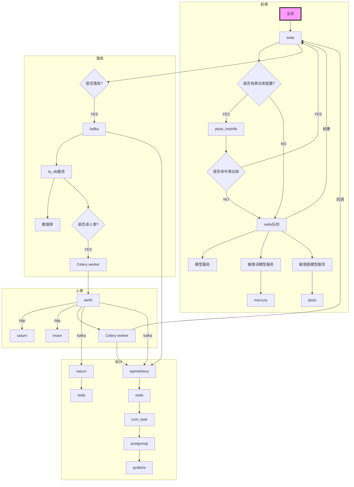
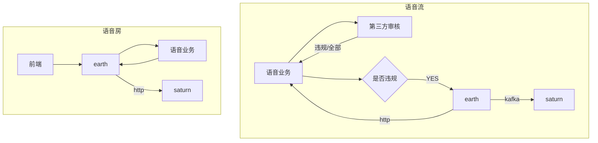

```mermaid
flowchart TD
    subgraph 机审
        A[业务] --> B[solar]
        style A fill: #f9f, stroke: #333, stroke-width: 4px
        B --> C{是否有黑白库配置?} -- YES --> D[pluto_hashlib]
        D --> E{是否命中黑白库} -- YES --> B
        C -- NO --> B1[redis队列]
        E -- NO --> B1
        B1 -- 结果 --> B
        B1 --> B2[模型服务]
        B1 --> B3[敏感词模型服务]
        B1 --> B4[敏感图模型服务]
        B3 --> F[mercury]
        B4 --> G[pluto]
    end
    subgraph 落库
        B --> H{是否落库?}
        H -- YES --> I[kafka] --> B5[to_db服务] --> J[数据库]
        B5 --> K{是否进人审?} -- YES --> K1[Celery worker]
    end
    subgraph 人审
        K1 --> M[earth]
        M -- http --> N[saturn]
        M -- http --> P[moon]
        M --> M1[Celery worker] -- 回调 --> B
    end
    subgraph 统计
        M -- kafka --> N1[saturn]
        N1 --> N2[redis]
        M -- kafka --> O[epimetheus]
        I --> O
        M1 --> O
        O --> O1[redis]
        O1 --> Q[cron_task]
        Q --> O2[postgresql]
        O2 --> O3[grafana]
    end
```

```mermaid
flowchart TD
    subgraph 语音流
        A[语音业务] --> B[第三方审核]
        B -- 违规/全部 --> A
        A --> B1{是否违规} -- YES --> C[earth]
        C -- http --> A
        C -- kafka --> D[saturn]
    end

    subgraph 语音房
        E[前端] --> C1[earth]
        C1 --> A1[语音业务]
        A1 -->C1
        C1 -- http --> D1[saturn]
    end
```